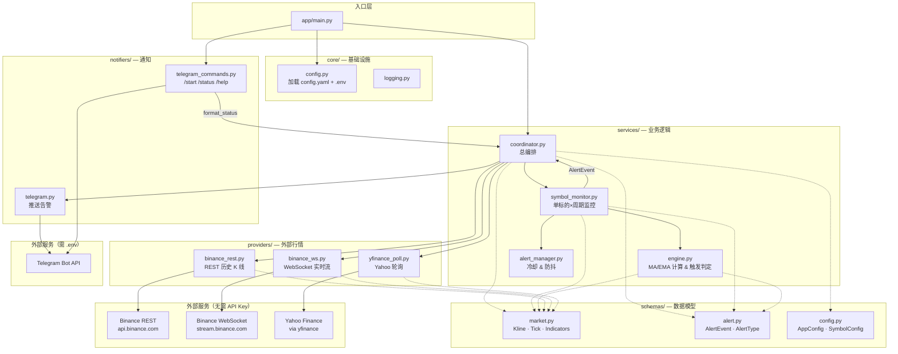
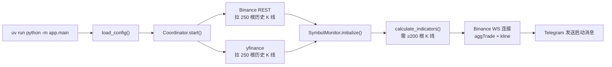
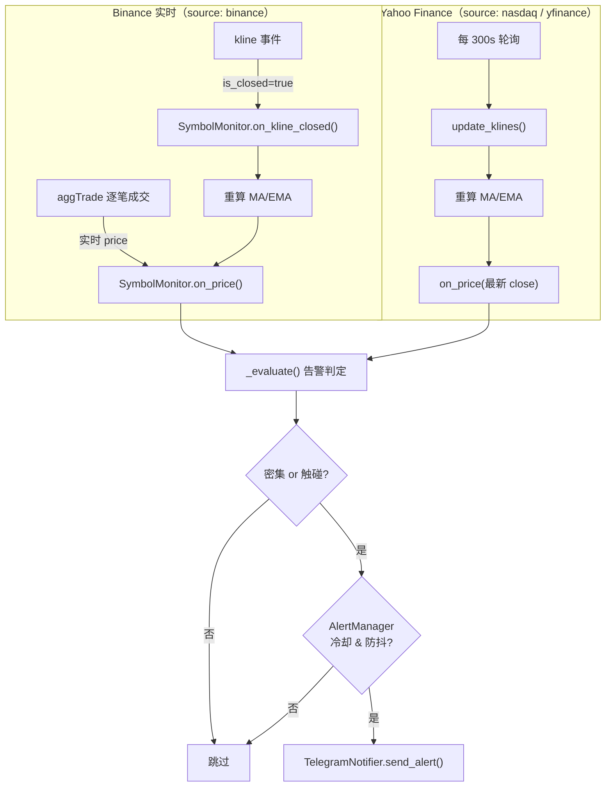
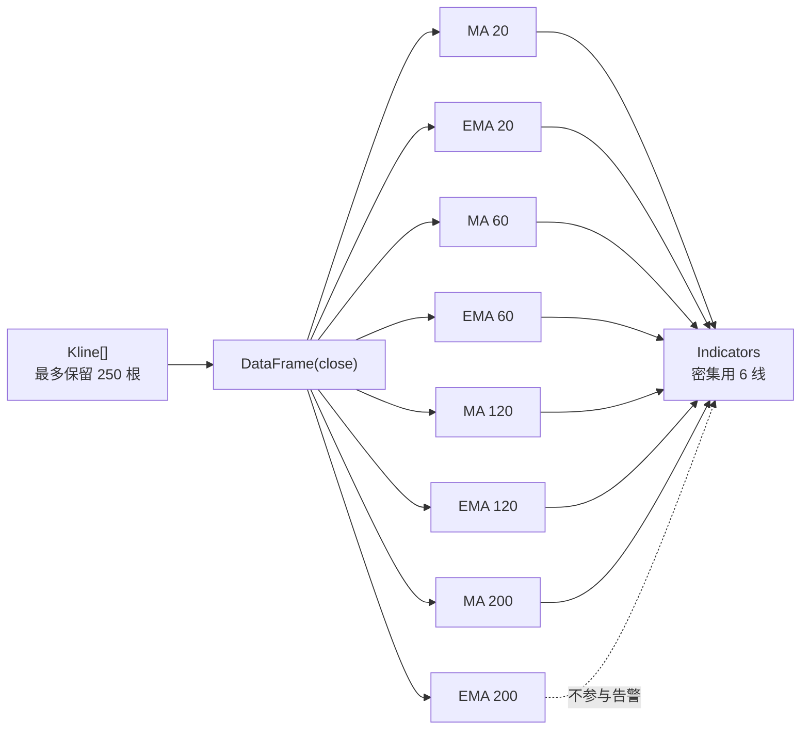
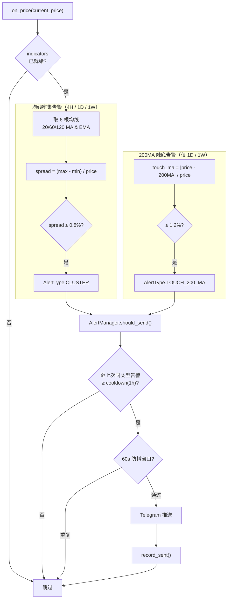

# Invest Alert Bot（抄底王）

一个基于 Python 的高频、低延迟行情监控与告警系统，专注于**均线簇密集度检测**与**关键均线触碰提醒**。满足条件时通过 Telegram 即时推送，辅助交易决策。

> 当前版本：**v0.1.0** — 混合数据源（Binance 合约 + Nasdaq/Yahoo）+ Telegram 推送

---

## 叠甲
作者本人不碰这个，也不参与这个行业，只玩模拟盘，纯好玩，不构成任何投资建议，只用于作为找工作项目。

## 核心思路

1. **价值投资**，只选有价值的标的，不选无价值标的
2. **捡漏**，不到捡漏价格绝对不入场，只要标的够多，一定有我们能捡漏的标的
3. **不输就是赢**，活下来第一
4. **不信新闻，不信数据，只认均线**，因为均线是靠真金白银堆出来的市场最终结果

---

## 核心功能

| 功能 | 说明 | 状态 |
|------|------|------|
| **均线密集告警** | 20/60/120 的 MA 与 EMA（6 根），**4H / 1D / 1W** spread ≤ 0.8% | ✅ |
| **200MA 触底告警** | 仅 **1D / 1W**，只看 **200MA**（不看 200EMA），距离 ≤ 1.2% | ✅ |
| **Telegram 交互** | 全部 `/status`、单标的 `/status BTC`、清屏 | ✅ |
| **Binance 合约** | 加密货币（BTC、ETH 等）WebSocket 实时 | ✅ |
| **Nasdaq / Yahoo** | 美股、黄金（GC=F）历史 K 线 + 轮询现价 | ✅ |
| **Telegram 推送** | 触碰即触发，冷却 + 防抖 | ✅ |
| **动态配置** | `config.yaml` 管理交易对 | ✅ |
| **数据库** | 无（v1 纯内存，重启后冷却重置） | — |

---

## 监控规则归纳

每个标的在 **3 个周期**上独立监控；告警按 `标的 + 周期 + 类型` 分别冷却。

**以 BTC/USDT 为例：**

| 检测项 | 4H | 1D | 1W |
|--------|----|----|-----|
| 均线密集（20/60/120 MA+EMA 六线 spread ≤ 0.8%） | ✅ | ✅ | ✅ |
| 200MA 触底（距 200MA ≤ 1.2%） | — | ✅ | ✅ |

> **4H 不做 200MA 触底**；**不看 200EMA**。

**当前 11 个标的**（详见 `config.yaml`）：

| 类别 | 标的 | 数据源 |
|------|------|--------|
| 加密货币 | BTC、ETH、SOL、BNB、HYPE | Binance 合约 |
| 美股 | MSFT、NVDA、MSTR、GOOGL、CRCL | `source: nasdaq`（Yahoo） |
| 黄金 | XAU（ticker: GC=F） | `source: nasdaq`（Yahoo） |

启动时需 **≥200 根 K 线** 才启用该周期；不足则跳过（如 HYPE 1W、CRCL 1W）。正常约 **31/33** 活跃。

---

| 层级 | 技术 |
|------|------|
| 语言 | Python 3.12+ |
| 包管理 | [uv](https://docs.astral.sh/uv/) |
| 行情 | Binance U 本位合约（加密）+ Yahoo Finance（美股/黄金） |
| 指标计算 | Pandas |
| 告警推送 | Telegram Bot API |
| 运行时 | Asyncio |
| 部署 | Docker + systemd |

---

## 项目结构

```
invest-alert-bot/
├── app/
│   ├── main.py                 # 入口
│   ├── core/                   # 配置、日志
│   ├── schemas/                # Pydantic 数据模型
│   ├── providers/              # Binance WS/REST, yfinance
│   ├── services/               # 计算引擎、告警管理、编排
│   └── notifiers/              # Telegram 推送
├── tests/
├── config.yaml                 # 监控标的与阈值
├── .env.example                # Telegram 密钥模板
├── Dockerfile
├── prd.md
├── plan.md
└── readme.md
```

---

## 系统架构

### 代码架构图

单进程 Asyncio 应用，按职责分层：`providers` 拉行情，`services` 算指标与编排，`notifiers` 对接 Telegram。



| 层级 | 目录 | 职责 |
|------|------|------|
| 入口 | `main.py` | 启动 Coordinator + Telegram 命令 Bot，处理 SIGINT/SIGTERM |
| 编排 | `coordinator.py` | 初始化 Monitor、连接数据源、路由 tick/kline 更新 |
| 监控 | `symbol_monitor.py` | 每个 `symbol × interval` 独立维护 K 线、指标、现价 |
| 引擎 | `engine.py` | Pandas 计算 MA/EMA，判定密集 & 触碰 |
| 告警 | `alert_manager.py` | 同一 `(symbol, interval, type)` 冷却 1h + 60s 防抖 |
| 行情 | `providers/` | Binance REST/WS、Yahoo 轮询，隔离第三方 API |
| 通知 | `notifiers/` | Telegram 推送与交互命令 |

---

### 数据流图

#### 启动阶段（Bootstrap）



#### 运行阶段（Runtime）



#### 数据源对照

| 配置 `source` | 历史 K 线 | 实时价格 | 说明 |
|---------------|-----------|----------|------|
| `binance` + `market: futures` | Binance 合约 REST | Binance 合约 WS | 加密货币，如 `BTC/USDT` |
| `nasdaq` | Yahoo Finance | 轮询最新 close | 美股代码如 `MSFT`；黄金 `XAU` + `ticker: GC=F` |
| `yfinance` | 同 nasdaq | 同 nasdaq | 与 `nasdaq` 等价，保留兼容 |

> 历史 K 线不足 200 根的周期会在启动时跳过（日志可见）。

---

### 算法流程图

#### 指标计算

基于**已闭合 K 线**的收盘价序列，用 Pandas 滚动/指数加权计算 8 条均线（最少 200 根 K 线才产出指标）。



#### 告警判定（每次价格更新触发）

**现价**来自实时 tick（Binance）或轮询 close（yfinance）；**均线**来自已闭合 K 线——触碰检测不等 K 线收盘。



#### 公式速查

**均线密集**（6 根均线：20/60/120 的 MA + EMA）：

```
spread = (max(6根均线) - min(6根均线)) / current_price
触发条件：spread ≤ thresholds.cluster（默认 0.8%）
```

**200MA 触底**（仅 1D / 1W，不看 4H，不看 200EMA）：

```
touch = abs(current_price - 200MA) / current_price
触发条件：touch ≤ thresholds.touch（默认 1.2%）
```

| 设计要点 | 说明 |
|----------|------|
| 触碰即触发 | 不等 K 线收盘，实时价一到就判定 |
| 指标基于闭合 K 线 | MA/EMA 不含当前未闭合 bar |
| 冷却 | 同一 `(symbol, interval, alert_type)` 默认 1 小时不重复推送 |
| 防抖 | 60 秒内同 key 不重复发送 |
| 纯内存 | 无数据库，重启后冷却状态重置 |

详细算法与验收标准见 [prd.md](./prd.md)。

---

## 快速开始

### 第一步：创建 Telegram Bot（只需做一次）

你需要两个东西：**Bot Token** 和 **Chat ID**。

#### 1. 用 BotFather 创建 Bot

1. 在 Telegram 搜索 **[@BotFather](https://t.me/BotFather)**，打开对话
2. 发送 `/newbot`
3. 按提示输入 Bot 显示名称，例如：`Invest Alert Bot`
4. 输入 Bot 用户名（必须以 `bot` 结尾），例如：`my_invest_alert_bot`
5. 创建成功后，BotFather 会返回一串 **Token**，格式类似：

   ```
   7123456789:AAHxxxxxxxxxxxxxxxxxxxxxxxxxxxxxxxxx
   ```

   复制保存，这就是 `TELEGRAM_BOT_TOKEN`。

#### 2. 获取你的 Chat ID

**方法 A（推荐）：自动脚本**

```bash
uv run python -m app.scripts.get_chat_id
```

按提示给 Bot 发一条消息，脚本会打印 `TELEGRAM_CHAT_ID`。

**方法 B：@userinfobot**

1. Telegram 搜索 **@userinfobot**，点 Start
2. 复制返回的 **Id**（纯数字）

**方法 C：浏览器 getUpdates**

1. 先给 Bot 发 `/start` 或任意消息
2. 访问（把 Token 换进去）：

   ```
   https://api.telegram.org/bot<TOKEN>/getUpdates
   ```

3. 找 `"chat":{"id":123456789}`

> 若 `getUpdates` 返回 `"result":[]`：确认消息已发给**正确的 Bot**，或先访问 `deleteWebhook` 再试。

#### 3. 写入 `.env`

```bash
cp .env.example .env
```

编辑 `.env`：

```env
TELEGRAM_BOT_TOKEN=7123456789:AAHxxxxxxxxxxxxxxxxxxxxxxxxxxxxxxxxx
TELEGRAM_CHAT_ID=123456789
```

---

### 第二步：安装与配置

```bash
# 安装 uv（如未安装）
curl -LsSf https://astral.sh/uv/install.sh | sh

git clone https://github.com/your-org/invest-alert-bot.git
cd invest-alert-bot

# 安装依赖
uv sync
```

编辑 `config.yaml`，配置要监控的标的：

```yaml
symbols:
  # 加密货币 — Binance 合约
  - symbol: BTC/USDT
    source: binance
    market: futures
    intervals: [4h, 1d, 1wk]

  # 美股 — Nasdaq（Yahoo Finance）
  - symbol: MSFT
    source: nasdaq
    intervals: [4h, 1d, 1wk]

  # 黄金 — COMEX 期货
  - symbol: XAU
    source: nasdaq
    ticker: GC=F
    intervals: [4h, 1d, 1wk]

thresholds:
  cluster: 0.008   # 密集 0.8%
  touch: 0.012     # 200MA 触底 1.2%
```

---

## 怎么运行？（没有 FastAPI）

本项目**不是 Web API**，没有 FastAPI / HTTP 服务。

只需要跑**一个 Python 进程**，它同时做两件事：

1. **监控行情**（Binance WebSocket + Yahoo 轮询 + 指标计算）
2. **Telegram Bot**（推送告警 + 响应 `/start` 等命令）

```bash
uv run python -m app.main
```

程序在跑 = Bot 在线；关掉终端 = Bot 离线。

---

### 第三步：运行

```bash
uv run python -m app.main
```

启动成功后，Telegram 会收到一条消息：

```
✅ Invest Alert Bot 已启动
正在监控 6 个标的 × 周期组合
触碰条件时将即时推送告警。
```

**Telegram 命令**（程序运行中可用）：

| 方式 | 说明 |
|------|------|
| 输入 `/` | 命令菜单（start / status / clear / help） |
| 底部按钮 | 📡 监控摘要 · 🧹 清屏 · ❓ 帮助 |

| 命令 | 作用 |
|------|------|
| `/status` | **全部**标的 × 周期（密集 / 200线 分块） |
| `/status BTC` | 只看单个标的 |
| `/clear` | 清屏（告警推送不删） |
| `/help` | 帮助 |

**告警推送**分两类标题：`📊 【均线密集】` 与 `🎯 【200MA 触碰】`（仅 1D/1W）。

> 若更新后 `/` 菜单没出现：重启 `app.main`，并关闭 Telegram 对话重新打开。

> 若只想验证 Telegram 配置（不启动监控），可运行：
>
> ```bash
> uv run python -m app.scripts.test_telegram
> ```

按 `Ctrl+C` 停止。

---

### 第四步：测试

```bash
uv run pytest tests/ -v
uv run ruff check app tests
```

---

## 告警消息示例

```
📊 Invest Alert Bot
━━━━━━━━━━━━━━━
告警类型: 均线密集
资产: BTC/USDT
周期: 4H
当前价: $67,432.5000
详情: 密集宽度 0.62% (阈值 0.8%)
时间: 2026-06-16 14:32:08 UTC
```

---

## 告警逻辑速览

算法流程图见上方 [算法流程图](#算法流程图) 章节。核心规则：

- **触碰即触发**，不等 K 线收盘
- MA/EMA 基于已闭合 K 线计算，实时价用于比较
- 同一告警默认 **1 小时冷却** + **60 秒防抖**，避免刷屏

---

## 配置说明

| 配置项 | 文件 | 说明 |
|--------|------|------|
| `TELEGRAM_BOT_TOKEN` | `.env` | BotFather 给的 Token |
| `TELEGRAM_CHAT_ID` | `.env` | 你的 Telegram 用户 ID |
| `symbols` | `config.yaml` | 监控标的列表 |
| `thresholds.cluster` | `config.yaml` | 密集阈值，默认 0.008 (0.8%) |
| `thresholds.touch` | `config.yaml` | 200MA 触底阈值，默认 0.012 (1.2%) |
| `alert.cooldown_seconds` | `config.yaml` | 冷却时间，默认 3600 秒 |

---

## Docker 部署

```bash
docker build -t invest-alert-bot .
docker run -d \
  --name invest-alert-bot \
  --restart always \
  --env-file .env \
  -v $(pwd)/config.yaml:/app/config.yaml \
  -v $(pwd)/logs:/app/logs \
  invest-alert-bot
```

推荐部署在**始终在线的 VM**（AWS EC2 / Lightsail），不适合 Serverless。

---

## 文档

| 文档 | 说明 |
|------|------|
| [prd.md](./prd.md) | 产品需求、验收标准 |
| [plan.md](./plan.md) | 开发计划、模块设计 |

---

## License

MIT
