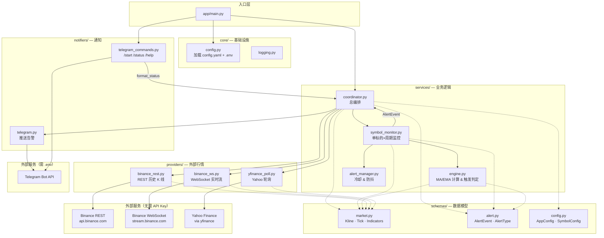
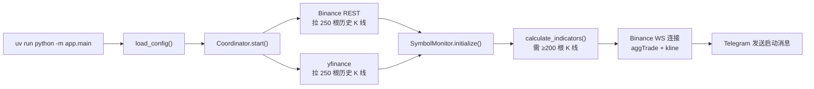
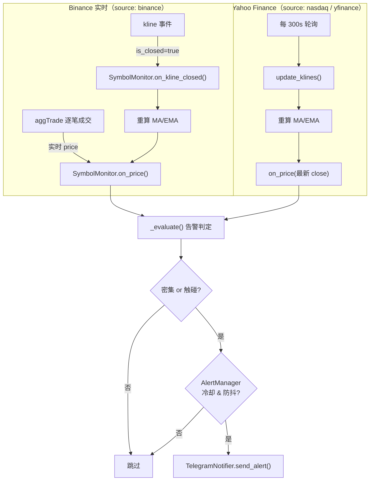
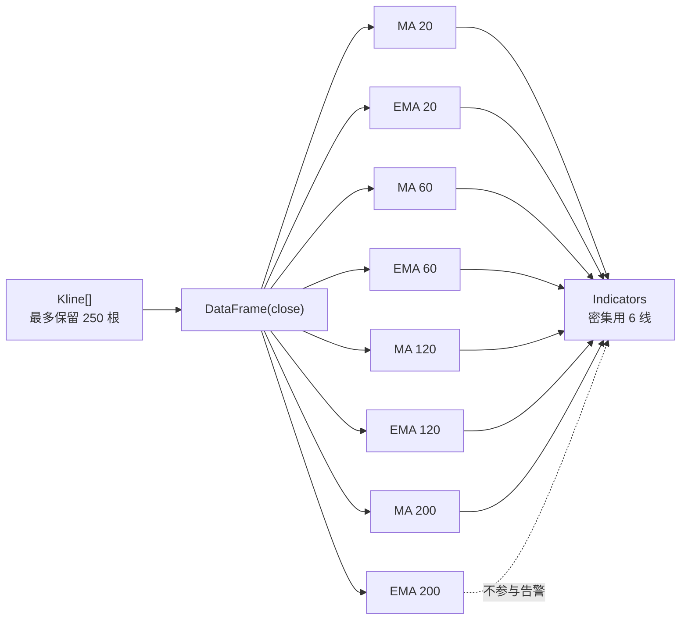
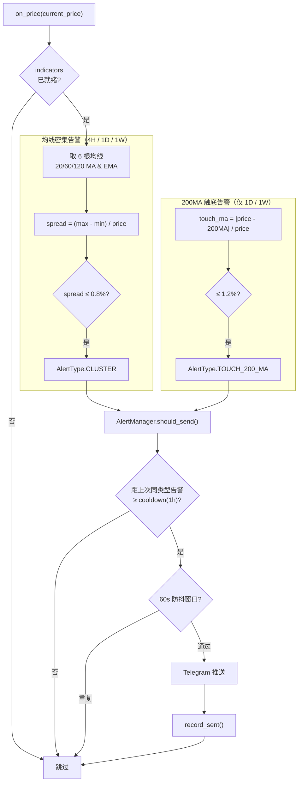
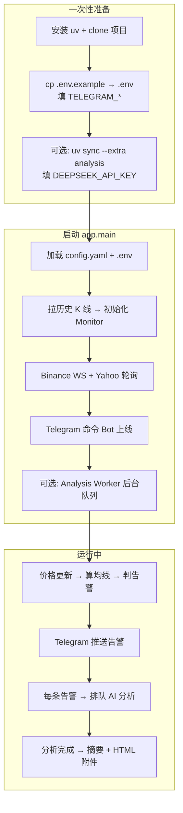
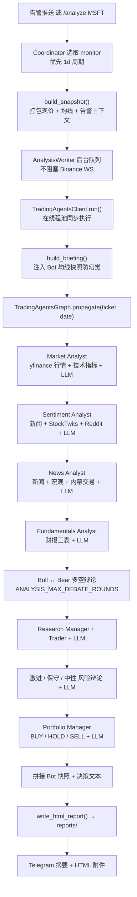

# Invest Alert Bot（抄底王）

**语言：** [English README](./README.md) · 中文（本页）

一个基于 Python 的高频、低延迟行情监控与告警系统，专注于**均线簇密集度检测**与**关键均线触碰提醒**。满足条件时通过 Telegram 即时推送，辅助交易决策。

**v0.2 起可选接入 [TradingAgents](https://github.com/TauricResearch/TradingAgents)**：均线规则负责「何时提醒」，TradingAgents 多智能体负责「告警后深度解读」。

> 当前版本：**v0.2** — 混合数据源 + Telegram 告警 + 可选 TradingAgents AI 分析

---

## 叠甲
作者本人不碰这个，也不参与这个行业，只玩模拟盘，纯好玩，不构成任何投资建议，只用于作为找工作项目。

## 核心思路

1. **价值投资**，只选有价值的标的，不选无价值标的
2. **捡漏**，不到捡漏价格绝对不入场，只要标的够多，一定有我们能捡漏的标的
3. **不输就是赢**，活下来第一
4. **不信新闻，不信数据，只认均线**，因为均线是靠真金白银堆出来的市场最终结果

---

## 核心功能

| 功能 | 说明 | 状态 |
|------|------|------|
| **均线密集告警** | 20/60/120 的 MA 与 EMA（6 根），**4H / 1D / 1W** spread ≤ 0.8% | ✅ |
| **200MA 触底告警** | 仅 **1D / 1W**，只看 **200MA**（不看 200EMA），距离 ≤ 1.2% | ✅ |
| **Telegram 交互** | 全部 `/status`、单标的 `/status BTC`、清屏 | ✅ |
| **Binance 合约** | 加密货币（BTC、ETH 等）WebSocket 实时 | ✅ |
| **Nasdaq / Yahoo** | 美股、黄金（GC=F）历史 K 线 + 轮询现价 | ✅ |
| **Telegram 推送** | 触碰即触发，冷却 + 防抖 | ✅ |
| **动态配置** | `config.yaml` 管理交易对 | ✅ |
| **AI 深度解读** | 告警后自动 TradingAgents 分析（可选） | ✅ |
| **数据库** | 无（v1 纯内存，重启后冷却重置） | — |

---

## 监控规则归纳

每个标的在 **3 个周期**上独立监控；告警按 `标的 + 周期 + 类型` 分别冷却。

**以 BTC/USDT 为例：**

| 检测项 | 4H | 1D | 1W |
|--------|----|----|-----|
| 均线密集（20/60/120 MA+EMA 六线 spread ≤ 0.8%） | ✅ | ✅ | ✅ |
| 200MA 触底（距 200MA ≤ 1.2%） | — | ✅ | ✅ |

> **4H 不做 200MA 触底**；**不看 200EMA**。

**当前 13 个标的**（详见 `config.yaml`）：Crypto 5 个 + 美股/ETF/黄金 8 个。

启动时需 **≥200 根 K 线** 才启用该周期；不足则跳过（如 HYPE 1W、CRCL 1W）。正常约 **37/39** 活跃。

---

| 层级 | 技术 |
|------|------|
| 语言 | Python 3.12+ |
| 包管理 | [uv](https://docs.astral.sh/uv/) |
| 行情 | Binance U 本位合约（加密）+ Yahoo Finance（美股/黄金） |
| 指标计算 | Pandas |
| 告警推送 | Telegram Bot API |
| 运行时 | Asyncio |
| 部署 | Docker + systemd |

---

## 项目结构

```
invest-alert-bot/
├── app/
│   ├── main.py                 # 入口
│   ├── core/                   # 配置、日志
│   ├── schemas/                # Pydantic 数据模型
│   ├── providers/              # Binance WS/REST, yfinance
│   ├── services/               # 计算引擎、告警管理、编排
│   └── notifiers/              # Telegram 推送
├── tests/
├── config.yaml                 # 监控标的与阈值
├── .env.example                # Telegram 密钥模板
├── Dockerfile
├── prd.md
├── plan.md
└── readme.md
```

---

## 系统架构

### 代码架构图

单进程 Asyncio 应用，按职责分层：`providers` 拉行情，`services` 算指标与编排，`notifiers` 对接 Telegram。



| 层级 | 目录 | 职责 |
|------|------|------|
| 入口 | `main.py` | 启动 Coordinator + Telegram 命令 Bot，处理 SIGINT/SIGTERM |
| 编排 | `coordinator.py` | 初始化 Monitor、连接数据源、路由 tick/kline 更新 |
| 监控 | `symbol_monitor.py` | 每个 `symbol × interval` 独立维护 K 线、指标、现价 |
| 引擎 | `engine.py` | Pandas 计算 MA/EMA，判定密集 & 触碰 |
| 告警 | `alert_manager.py` | 同一 `(symbol, interval, type)` 冷却 1h + 60s 防抖 |
| 行情 | `providers/` | Binance REST/WS、Yahoo 轮询，隔离第三方 API |
| 通知 | `notifiers/` | Telegram 推送与交互命令 |

---

### 数据流图

#### 启动阶段（Bootstrap）



#### 运行阶段（Runtime）



#### 数据源对照

| 配置 `source` | 历史 K 线 | 实时价格 | 说明 |
|---------------|-----------|----------|------|
| `binance` + `market: futures` | Binance 合约 REST | Binance 合约 WS | 加密货币，如 `BTC/USDT` |
| `nasdaq` | Yahoo Finance | 轮询最新 close | 美股代码如 `MSFT`；黄金 `XAU` + `ticker: GC=F` |
| `yfinance` | 同 nasdaq | 同 nasdaq | 与 `nasdaq` 等价，保留兼容 |

> 历史 K 线不足 200 根的周期会在启动时跳过（日志可见）。

---

### 算法流程图

#### 指标计算

基于**已闭合 K 线**的收盘价序列，用 Pandas 滚动/指数加权计算 8 条均线（最少 200 根 K 线才产出指标）。



#### 告警判定（每次价格更新触发）

**现价**来自实时 tick（Binance）或轮询 close（yfinance）；**均线**来自已闭合 K 线——触碰检测不等 K 线收盘。



#### 公式速查

**均线密集**（6 根均线：20/60/120 的 MA + EMA）：

```
spread = (max(6根均线) - min(6根均线)) / current_price
触发条件：spread ≤ thresholds.cluster（默认 0.8%）
```

**200MA 触底**（仅 1D / 1W，不看 4H，不看 200EMA）：

```
touch = abs(current_price - 200MA) / current_price
触发条件：touch ≤ thresholds.touch（默认 1.2%）
```

| 设计要点 | 说明 |
|----------|------|
| 触碰即触发 | 不等 K 线收盘，实时价一到就判定 |
| 指标基于闭合 K 线 | MA/EMA 不含当前未闭合 bar |
| 冷却 | 同一 `(symbol, interval, alert_type)` 默认 1 小时不重复推送 |
| 防抖 | 60 秒内同 key 不重复发送 |
| 纯内存 | 无数据库，重启后冷却状态重置 |

详细算法与验收标准见 [prd.md](./prd.md)。

---

## 完整流程：安装 → 启动 → 验证

本项目是**单进程** Bot（不是 Web API）：一个命令同时跑 **行情监控 + Telegram 命令 +（可选）AI 分析**。

### 流程总览



### 第一步：安装依赖

```bash
cd invest-alert-bot

# 基础功能（监控 + 告警，必装）
uv sync

# 若要 AI 分析（TradingAgents + DeepSeek），额外执行：
uv sync --extra analysis
```

> **别忘**：只用 `uv sync` 也能正常监控告警；**没装 `--extra analysis` 就没有 AI**，启动消息会提示「未安装」。

### 第二步：配置环境

```bash
cp .env.example .env
```

**最少必填**（监控告警）：

```env
TELEGRAM_BOT_TOKEN=你的BotFather令牌
TELEGRAM_CHAT_ID=你的数字ID
```

**若要 AI 分析**，在 `.env` 再加：

```env
ANALYSIS_ENABLED=true
LLM_PROVIDER=deepseek
DEEPSEEK_API_KEY=你的DeepSeek密钥
```

DeepSeek 的 API 地址由 TradingAgents 包内置（`https://api.deepseek.com`），一般**不用**自己配 base URL。监控标的与阈值改 `config.yaml`。

### 第三步：启动

```bash
uv run python -m app.main
```

**成功标志：**

1. 终端无报错，日志类似：
   - `Coordinator started with XX monitors`
   - `Binance futures WS started`
   - `Equity poller started: MSFT ...`
   - `Analysis worker started`（若启用 AI）
2. Telegram 收到启动消息，含监控数量与 `🧠 AI 分析：已启用 (deepseek)` 等状态
3. 发 `/start` 或 `/status` 有回复

按 `Ctrl+C` 停止。

### 第四步：验证（推荐顺序）

| # | 验证项 | 命令 / 操作 | 预期结果 |
|---|--------|-------------|----------|
| 1 | 单元测试 | `uv run pytest tests/ -v` | 全部 PASS |
| 2 | 代码检查 | `uv run ruff check app tests` | 无 error |
| 3 | Telegram 连通 | `uv run python -m app.scripts.test_telegram` | 收到测试消息 |
| 4 | Bot 在线 | Telegram 发 `/status` | 返回全部标的监控数据 |
| 5 | 单标的 | `/status MSFT` | 返回 MSFT 各周期密集/200MA |
| 6 | AI 包已装 | `uv run python -c "import tradingagents; print('ok')"` | 打印 `ok`（未装 AI 可跳过） |
| 7 | 手动 AI | `/analyze MSFT` | 「分析排队中…」→ 约 5～20 分钟后摘要 + HTML 附件 |
| 8 | 告警链路 | 等真实告警或观察日志 `Alert triggered` | 告警推送 → 自动排队 AI（若启用） |

**日志位置**：`logs/app.log`（可在 `config.yaml` 的 `logging` 段调整）。

**AI 报告位置**：`reports/report_*.html`（Telegram 也会发同名附件）。

### 常见问题

| 现象 | 原因 | 处理 |
|------|------|------|
| 启动报 `TELEGRAM_* missing` | `.env` 未填 | 按 `.env.example` 补全 |
| AI 显示「未安装」 | 没跑 `uv sync --extra analysis` | 执行后重启 |
| AI 显示「未启用」 | `ANALYSIS_ENABLED=false` | 改为 `true` 并填 `DEEPSEEK_API_KEY` |
| `/status` 有 `nan%` | Yahoo 未收盘 K 线（已修复） | 更新代码并重启 |
| 部分周期被跳过 | K 线不足 200 根 | 看启动日志 `Skip monitor`，属正常 |

---

## 快速开始

### 第一步：创建 Telegram Bot（只需做一次）

你需要两个东西：**Bot Token** 和 **Chat ID**。

#### 1. 用 BotFather 创建 Bot

1. 在 Telegram 搜索 **[@BotFather](https://t.me/BotFather)**，打开对话
2. 发送 `/newbot`
3. 按提示输入 Bot 显示名称，例如：`Invest Alert Bot`
4. 输入 Bot 用户名（必须以 `bot` 结尾），例如：`my_invest_alert_bot`
5. 创建成功后，BotFather 会返回一串 **Token**，格式类似：

   ```
   7123456789:AAHxxxxxxxxxxxxxxxxxxxxxxxxxxxxxxxxx
   ```

   复制保存，这就是 `TELEGRAM_BOT_TOKEN`。

#### 2. 获取你的 Chat ID

**方法 A（推荐）：自动脚本**

```bash
uv run python -m app.scripts.get_chat_id
```

按提示给 Bot 发一条消息，脚本会打印 `TELEGRAM_CHAT_ID`。

**方法 B：@userinfobot**

1. Telegram 搜索 **@userinfobot**，点 Start
2. 复制返回的 **Id**（纯数字）

**方法 C：浏览器 getUpdates**

1. 先给 Bot 发 `/start` 或任意消息
2. 访问（把 Token 换进去）：

   ```
   https://api.telegram.org/bot<TOKEN>/getUpdates
   ```

3. 找 `"chat":{"id":123456789}`

> 若 `getUpdates` 返回 `"result":[]`：确认消息已发给**正确的 Bot**，或先访问 `deleteWebhook` 再试。

#### 3. 写入 `.env`

```bash
cp .env.example .env
```

编辑 `.env`：

```env
TELEGRAM_BOT_TOKEN=7123456789:AAHxxxxxxxxxxxxxxxxxxxxxxxxxxxxxxxxx
TELEGRAM_CHAT_ID=123456789
```

---

### 第二步：安装与配置

```bash
# 安装 uv（如未安装）
curl -LsSf https://astral.sh/uv/install.sh | sh

git clone https://github.com/your-org/invest-alert-bot.git
cd invest-alert-bot

# 安装依赖（见上方「完整流程」；要 AI 则加 --extra analysis）
uv sync
# uv sync --extra analysis
```

编辑 `config.yaml`，配置要监控的标的：

```yaml
symbols:
  # 加密货币 — Binance 合约
  - symbol: BTC/USDT
    source: binance
    market: futures
    intervals: [4h, 1d, 1wk]

  # 美股 — Nasdaq（Yahoo Finance）
  - symbol: MSFT
    source: nasdaq
    intervals: [4h, 1d, 1wk]

  # 黄金 — COMEX 期货
  - symbol: XAU
    source: nasdaq
    ticker: GC=F
    intervals: [4h, 1d, 1wk]

thresholds:
  cluster: 0.008   # 密集 0.8%
  touch: 0.012     # 200MA 触底 1.2%
```

---

## 怎么运行？（没有 FastAPI）

本项目**不是 Web API**。启动与验证步骤见上方 **[完整流程：安装 → 启动 → 验证](#完整流程安装--启动--验证)**。

```bash
uv run python -m app.main
```

程序在跑 = Bot 在线；关掉终端 = Bot 离线。

---

### Telegram 命令（运行中）

| 命令 | 作用 |
|------|------|
| `/start` | 欢迎与按钮菜单 |
| `/status` | 全部标的 × 周期 |
| `/status BTC` | 单标的 |
| `/analyze MSFT` | 手动 AI 深度分析（需启用 AI） |
| `/clear` | 清屏（不删告警） |
| `/help` | 帮助 |

**告警推送**：`📊 【均线密集-开仓机会】` / `🎯 【200MA 触碰-抄底机会】`  
**告警后**（若启用 AI）：自动 `🧠 分析排队中…` → 摘要 + HTML 附件。

> 若只想验证 Telegram（不启动监控）：`uv run python -m app.scripts.test_telegram`

按 `Ctrl+C` 停止。

---

### 单元测试

```bash
uv run pytest tests/ -v
uv run ruff check app tests
```

---

## 告警消息示例

```
📊 Invest Alert Bot
━━━━━━━━━━━━━━━
告警类型: 均线密集
资产: BTC/USDT
周期: 4H
当前价: $67,432.5000
详情: 密集宽度 0.62% (阈值 0.8%)
时间: 2026-06-16 14:32:08 UTC
```

---

## 告警逻辑速览

算法流程图见上方 [算法流程图](#算法流程图) 章节。核心规则：

- **触碰即触发**，不等 K 线收盘
- MA/EMA 基于已闭合 K 线计算，实时价用于比较
- 同一告警默认 **1 小时冷却** + **60 秒防抖**，避免刷屏

---

## 配置说明

| 配置项 | 文件 | 说明 |
|--------|------|------|
| `TELEGRAM_BOT_TOKEN` | `.env` | BotFather 给的 Token |
| `TELEGRAM_CHAT_ID` | `.env` | 你的 Telegram 用户 ID |
| `symbols` | `config.yaml` | 监控标的列表 |
| `thresholds.cluster` | `config.yaml` | 密集阈值，默认 0.008 (0.8%) |
| `thresholds.touch` | `config.yaml` | 200MA 触底阈值，默认 0.012 (1.2%) |
| `alert.cooldown_seconds` | `config.yaml` | 冷却时间，默认 3600 秒 |

---

## Docker 部署

```bash
docker build -t invest-alert-bot .
docker run -d \
  --name invest-alert-bot \
  --restart always \
  --env-file .env \
  -v $(pwd)/config.yaml:/app/config.yaml \
  -v $(pwd)/logs:/app/logs \
  invest-alert-bot
```

推荐部署在**始终在线的 VM**（AWS EC2 / Lightsail），不适合 Serverless。

---

## 与 TradingAgents 的关系

本项目是 **[TradingAgents](https://github.com/TauricResearch/TradingAgents)** 的**下游集成项目**（consumer / integration），不是 TradingAgents 官方仓库的分叉。

| | TradingAgents（上游） | Invest Alert Bot（本项目） |
|---|----------------------|---------------------------|
| 定位 | 多智能体 LLM 金融研究框架 | 7×24 均线监控 + Telegram 告警 Bot |
| 触发方式 | CLI / 代码手动 `propagate(ticker, date)` | **每条告警自动排队** + `/analyze` 手动 |
| 延迟 | 分钟级 | 告警秒级；AI 分析异步 5～20 分钟 |
| 核心逻辑 | 基本面 / 情绪 / 新闻 / 多空辩论 | **规则化均线**（密集 + 200MA） |
| 接入方式 | Python 包 `tradingagents` | `uv sync --extra analysis` |

### 本项目中 TradingAgents 用在哪

**分工**：Bot 负责「什么时候看」（秒级规则告警）；TradingAgents 负责「怎么看、值不值得动手」（分钟级多智能体研究）。均线仍是**唯一自动告警源**，AI 不修改阈值、不自动下单。

#### 端到端流程



#### 结果取决于什么

| 来源 | 内容 | 确定性 |
|------|------|--------|
| **Invest Alert Bot** | 现价、MA20/60/120/200、密集度、200MA 距离、触发告警 | 高（实时 K 线计算） |
| **TradingAgents / yfinance** | 行情、MACD/RSI、财报、新闻 | 中（外部 API） |
| **TradingAgents / StockTwits** | 散户 Bullish/Bearish 情绪 | 中 |
| **TradingAgents / Reddit** | r/wallstreetbets、r/stocks、r/investing 讨论 | 低（常被 403 拦截，降级继续） |
| **DeepSeek / OpenAI 等 LLM** | 多空辩论、综合倾向 | 低（同标的两次可能不同） |

#### 为什么慢？

TradingAgents 默认串行跑 **4 个分析师 + 多空辩论 + 交易员 + 三方风险辩论 + 投资组合经理**，每步都要等网络拉数 + LLM 推理（单次 10～60 秒）。完整一次分析通常 **5～20 分钟**，默认超时 `ANALYSIS_TIMEOUT_SECONDS=1800`（30 分钟）。

Reddit 403 是 TradingAgents 情绪分析师的内置数据源被反爬拦截，**会降级为空数据继续跑**，与超时失败无关。

- 封装代码：`app/providers/tradingagents_client.py`
- 设计文档：[tradingagents-iteration.md](./tradingagents-iteration.md)
- LLM 默认：`LLM_PROVIDER=deepseek`（亦支持 OpenAI 等 TradingAgents 已支持 provider）

### 引用 TradingAgents 论文

若在 README / 简历 / 其他文档中引用上游框架，可使用：

```bibtex
@misc{xiao2025tradingagentsmultiagentsllmfinancial,
      title={TradingAgents: Multi-Agents LLM Financial Trading Framework},
      author={Yijia Xiao and Edward Sun and Di Luo and Wei Wang},
      year={2025},
      eprint={2412.20138},
      archivePrefix={arXiv},
      primaryClass={q-fin.TR},
      url={https://arxiv.org/abs/2412.20138},
}
```


## 启用 AI 分析（TradingAgents）

> **重要**：不安装 AI 依赖时，监控与告警 **完全正常**；只有 AI 深度解读不会运行。

### 1. 安装可选依赖

```bash
uv sync --extra analysis
```

### 2. 配置 `.env`

复制 `.env.example` 中 **AI 分析** 段落，至少设置：

```env
ANALYSIS_ENABLED=true
LLM_PROVIDER=deepseek
DEEPSEEK_API_KEY=你的密钥
```

DeepSeek 使用 OpenAI 兼容 API（endpoint 由 TradingAgents 内置 `https://api.deepseek.com`）。若用 OpenAI，改 `LLM_PROVIDER=openai` 并填 `OPENAI_API_KEY`。

可选调优：

```env
ANALYSIS_ANALYSTS=market,news,fundamentals  # 逗号分隔；默认去掉 social
ANALYSIS_MAX_DEBATE_ROUNDS=1        # 多空辩论轮数，越大越慢
ANALYSIS_TIMEOUT_SECONDS=1800       # 单次分析超时（秒），默认 30 分钟
```

### 3. 行为说明

| 事件 | 行为 |
|------|------|
| **任意告警推送后** | 自动排队 TradingAgents 分析（约 5～20 分钟） |
| 分析开始 | Telegram 提示「分析排队中…」 |
| 分析完成 | **摘要消息** + **HTML 报告附件** |
| `/analyze MSFT` | 手动触发（不依赖告警） |

报告 HTML 保存在本地 `reports/` 目录，Telegram 中点击附件可在浏览器打开全文。

启动消息会显示：`🧠 AI 分析：已启用 (deepseek)` 或 `未启用` / `未安装`。

详见 [tradingagents-iteration.md](./tradingagents-iteration.md)。

---

## 文档

| 文档 | 说明 |
|------|------|
| [prd.md](./prd.md) | 产品需求、验收标准 |
| [plan.md](./plan.md) | 开发计划、模块设计 |
| [tradingagents-iteration.md](./tradingagents-iteration.md) | TradingAgents 接入设计与路线图 |
| [TradingAgents 上游](https://github.com/TauricResearch/TradingAgents) | 官方多智能体框架仓库 |

---

## License

仅供个人学习使用，禁止他人商用，作者是https://github.com/Formyselfonly

b站：郑同学是我

合作或者需要付费完整版，请联系作者
