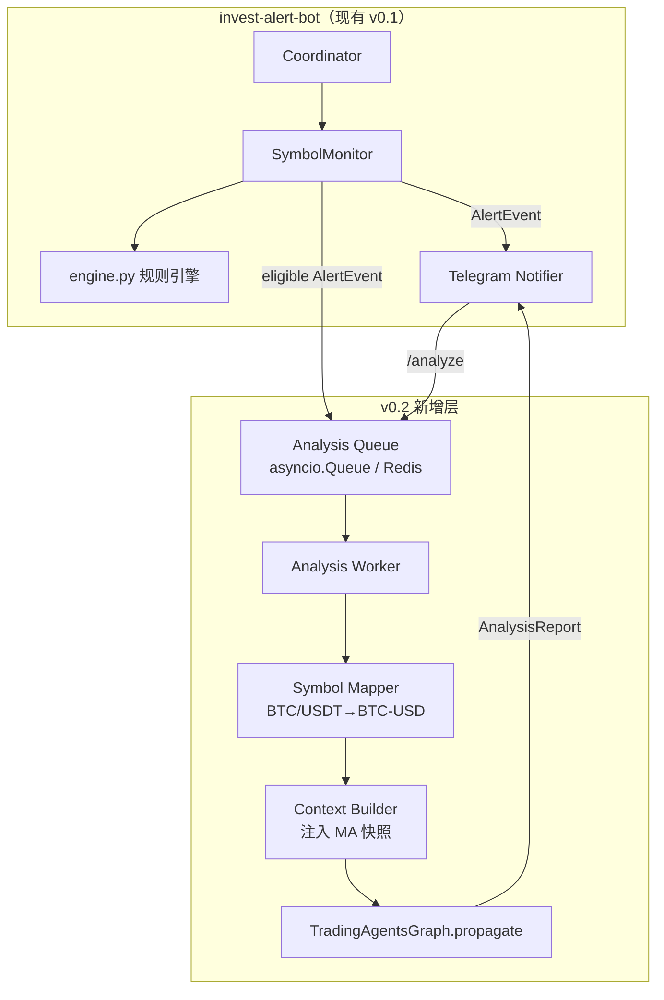

# Invest Alert Bot × TradingAgents 迭代规划

> 基于 [TradingAgents](https://github.com/TauricResearch/TradingAgents)（TauricResearch，LangGraph 多智能体金融分析框架）的后续接入方案。  
> 当前 Bot 版本：**v0.1.0**（规则引擎 + Telegram 实时告警）  
> 目标版本：**v0.2+**（告警 → 可选 AI 深度解读，仍不自动下单）

---

## 1. 一句话结论

**TradingAgents 不应替代你的均线监控引擎，而应作为「告警之后的第二大脑」**：  
Bot 负责 **毫秒～秒级、确定性、可回测** 的「什么时候看」；TradingAgents 负责 **分钟级、多维度、非确定性** 的「怎么看、值不值得动手」。

这与 readme 里的原则一致：

| 你的原则 | Bot v0.1 | + TradingAgents 后 |
|---------|----------|-------------------|
| 只认均线 | 100% 规则触发 | 均线仍是 **唯一自动告警源** |
| 捡漏 / 抄底 | 200MA 触碰 + 密集 | AI 补充 **基本面 / 情绪 / 新闻** 是否支持「这次像捡漏」 |
| 不输就是赢 | 冷却 + 风险提示语 | 增加 **Risk / Portfolio Manager** 视角的仓位建议摘要 |
| 不做投机只做投资 | 无 | 明确标注 AI 输出为 **研究辅助，非交易指令** |

---

## 2. 为什么要接入？

### 2.1 当前 Bot 的边界（v0.1 已做得很好）

- ✅ 多标的、多周期、低延迟、Telegram 即用  
- ✅ 规则透明：`spread ≤ 0.8%`、`距 200MA ≤ 1.2%`  
- ❌ 无法回答：「这次触碰是假跌破还是真抄底？」「宏观/财报/情绪是否恶化？」「仓位该多大？」

### 2.2 TradingAgents 补什么

[TradingAgents](https://github.com/TauricResearch/TradingAgents) 提供 **多角色 LLM 协作**（LangGraph）：

| 角色 | 能力 | 对你项目的价值 |
|------|------|----------------|
| Technical Analyst | MACD、RSI 等 | 可 **注入你已算好的 MA 指标**，避免 LLM 瞎编价格 |
| Fundamentals Analyst | 财报、估值 | 美股/ETF 抄底时看「便宜是有原因还是错杀」 |
| Sentiment / News Analyst | 新闻、社交情绪 | .crypto 剧烈波动时看舆论是否极端 |
| Bull / Bear Researchers | 多空辩论 | 减少单边叙事 |
| Trader + Risk + Portfolio Manager | 综合决策 | 输出 **BUY/HOLD/SELL + 理由**，但不接实盘 |

### 2.3 为什么不直接「只用 TradingAgents」

| 维度 | Invest Alert Bot | TradingAgents |
|------|------------------|---------------|
| 延迟 | 秒级 | 分钟级（多轮 LLM + 外部 API） |
| 成本 | 几乎为零 | 每次分析消耗 Token（GPT-5.x 等） |
| 确定性 | 高，可 pytest | 低，同 ticker 两次结果可能不同 |
| 7×24 监控 | 适合 | 不适合作为常驻轮询 |
| 你的核心策略 | **均线** | 默认偏「全因子」研究框架 |

**结论：监控用 Bot，解读用 TradingAgents，分工清晰。**

---

## 3. 接入后是什么样？（用户体验）

### 3.1 告警链路（目标态）

```
价格更新
  → SymbolMonitor 规则判定（不变）
  → Telegram 推送【均线密集-开仓机会】/【200MA 触碰-抄底机会】（不变）
  → [可选] 进入 Analysis Queue
  → TradingAgents.propagate(ticker, date)
  → Telegram 第二条：【AI 深度解读】摘要（1～3 分钟延迟）
```

### 3.2 Telegram 消息示例（v0.2 目标）

**第一条（现有，秒级）：**

```
🎯 【200MA 触碰-抄底机会】
`MSFT` · 1D · $399.97
距 200MA 触碰 1.05% (阈值 1.2%) · 价格在200MA 下方
_2026-06-16 14:32 UTC_
```

**第二条（新增，分钟级）：**

```
🧠 【AI 深度解读】（TradingAgents · 仅供参考）
`MSFT` · 触发源：200MA 触底 1D

📌 Bot 快照：六线密集 0.71% · 200MA 下方 1.05%
📊 技术面：与 Bot 指标一致，RSI 未超卖…
📰 新闻/情绪：中性偏谨慎…
⚖️ 多空辩论：Bear 担心云增速放缓 / Bull 看好 AI 变现…
🎯 综合倾向：HOLD（研究结论，非交易建议）
💡 仓位管理最重要，不输就是赢，不做投机只做投资

_分析耗时 127s · gpt-4.1 · LangSmith trace: xxx_
```

**手动命令（v0.2+）：**

- `/analyze MSFT` — 不依赖告警，主动跑一次分析（受日配额限制）
- `/analyze MSFT --quick` — 只跑 Technical + Trader，省 Token

### 3.3 接入后 **不会** 发生什么

- ❌ 不会自动下单  
- ❌ 不会让 LLM 改写告警阈值  
- ❌ 不会在每次 `/status` 轮询时调用 LLM（成本爆炸）  
- ❌ 不会把「AI 说买入」当成触发条件  

---

## 4. 怎么接入？（推荐架构）

### 4.1 总体原则

1. **事件驱动**：仅在有意义的告警（或用户命令）时调用 AI。  
2. **结构化输入**：把 Bot 已计算的指标作为 **Ground Truth** 传给 TradingAgents，减少幻觉。  
3. **进程隔离**：TradingAgents 分析跑在 **独立 worker**（或线程池 + 超时），不阻塞 Binance WS。  
4. **配额与冷却**：分析独立于告警冷却（建议每标的每天 ≤1 次自动分析）。  

### 4.2 逻辑架构



### 4.3 目录规划（贴合现有分层）

在 **不破坏** 现有 `providers/` / `services/` / `notifiers/` 的前提下扩展：

```
invest-alert-bot/
├── app/
│   ├── providers/
│   │   └── tradingagents_client.py   # 封装 TradingAgentsGraph，超时/重试
│   ├── services/
│   │   ├── analysis_queue.py         # 队列 + 配额 + 去重
│   │   ├── analysis_context.py       # Bot 指标 → TA 输入 JSON
│   │   └── analysis_worker.py        # 后台消费，调用 client
│   ├── schemas/
│   │   └── analysis.py               # AnalysisRequest / AnalysisReport
│   └── notifiers/
│       └── telegram_analysis.py      # 长文摘要格式化（分段发送）
├── config.yaml                       # 新增 analysis: 段
└── tradingagents-iteration.md        # 本文档
```

> 若后续拆微服务：将 `analysis_*` + `tradingagents_client` 整体迁到 `backend/analysis-service/`，Bot 通过 Redis/HTTP 投递 `AnalysisRequest` 即可。

### 4.4 核心代码接口（草案）

**Symbol 映射**（`analysis_context.py`）：

| config.yaml | TradingAgents ticker |
|-------------|----------------------|
| `BTC/USDT` | `BTC-USD` |
| `ETH/USDT` | `ETH-USD` |
| `MSFT` | `MSFT` |
| `XAU` + `GC=F` | `GC=F` 或 `XAUUSD=X` |
| `QQQ` / `VOO` | 同名 |

**上下文注入**（供 Technical Analyst  grounding）：

```python
@dataclass
class BotSignalSnapshot:
    symbol: str
    interval: str
    alert_type: str          # cluster | touch_200_ma
    price: float
    cluster_pct: float | None
    touch_ma_pct: float | None
    ma200_side: str          # 上方 / 下方
    ma_20: float
    ma_60: float
    ma_120: float
    ma_200: float
    triggered_at: datetime
```

在调用 `ta.propagate(ticker, date)` **之前**，通过 TradingAgents 的 config 或自定义 prompt 前缀，写入：

> 「以下均线数据来自监控 Bot 实时计算，请以之为准，勿自行编造价格。」

**Worker 伪代码**：

```python
async def handle_alert(event: AlertEvent, snapshot: BotSignalSnapshot) -> None:
    if not analysis_policy.should_run(event):
        return
    request = AnalysisRequest.from_alert(event, snapshot)
    await analysis_queue.put(request)

async def worker_loop() -> None:
    while True:
        req = await analysis_queue.get()
        report = await asyncio.to_thread(
            run_tradingagents_with_timeout,
            req,
            timeout=300,
        )
        await telegram.send_analysis(report)
```

**TradingAgents 调用**（库模式，与官方 README 一致）：

```python
from tradingagents.graph.trading_graph import TradingAgentsGraph
from tradingagents.default_config import DEFAULT_CONFIG

config = DEFAULT_CONFIG.copy()
config["llm_provider"] = "openai"
config["deep_think_llm"] = "gpt-4.1"       # 成本可控；研究可换 gpt-5.x
config["quick_think_llm"] = "gpt-4.1"
config["max_debate_rounds"] = 1            # Telegram 场景建议降低轮数
config["temperature"] = 0.2

ta = TradingAgentsGraph(debug=False, config=config)
_, decision = ta.propagate("MSFT", "2026-06-16")
```

### 4.5 触发策略（建议默认）

| 场景 | 是否自动跑 TA | 理由 |
|------|--------------|------|
| 仅 4H 密集 | ❌ | 偏短线整理，AI 性价比低 |
| 1D/1W 200MA 触底 | ✅ | 符合「抄底」语义 |
| 1D/1W 密集 + 200MA 同时 | ✅ 优先 | 最强信号，值得深度解读 |
| 用户 `/analyze` | ✅ | 显式意图 |
| 冷却期内重复告警 | ❌ | 节省 Token |

配置示例（`config.yaml` 未来段）：

```yaml
analysis:
  enabled: false                    # v0.2 默认关，稳定后开
  provider: tradingagents
  auto_on_alert_types:
    - touch_200_ma                  # 仅 200MA 触底自动分析
  auto_intervals: [1d, 1wk]
  also_on_simultaneous_cluster: true # 密集+触底同时 → 必跑
  cooldown_seconds: 86400           # 每标的每天最多 1 次自动分析
  max_debate_rounds: 1
  llm_provider: openai
  deep_think_llm: gpt-4.1
  quick_think_llm: gpt-4.1
  timeout_seconds: 300
```

### 4.6 依赖与环境

```bash
# 方式 A：uv 添加 git 依赖（推荐 pin tag）
uv add "tradingagents @ git+https://github.com/TauricResearch/TradingAgents@v0.2.5"

# 方式 B：Docker 侧车（analysis-worker 容器单独 pip install .）
```

`.env` 新增（与 TradingAgents 对齐）：

```env
OPENAI_API_KEY=...
# 可选
LANGCHAIN_API_KEY=...              # LangSmith 追踪
TRADINGAGENTS_CACHE_DIR=./data/ta-cache
TRADINGAGENTS_MEMORY_LOG_PATH=./data/ta-memory.md
```

---

## 5. 分阶段路线图

### Phase 0 — 调研验证（1～2 天）

- [ ] 本地 `pip install .` TradingAgents，对 `MSFT`、`BTC-USD` 手动 `propagate`  
- [ ] 记录：耗时、Token 成本、输出结构、与 Bot 指标是否冲突  
- [ ] 确认 Apache-2.0 许可证可接受（与 MIT 项目兼容）

### Phase 1 — v0.2 最小接入（MVP）

- [ ] `tradingagents_client.py` + 超时 300s  
- [ ] `/analyze MSFT` 命令（仅手动，无自动）  
- [ ] Telegram 推送纯文本摘要（decision + 一段 rationale）  
- [ ] **不**改现有告警逻辑  

**验收**：Bot 监控不受影响；手动分析 3 分钟内返回；失败有 Telegram 错误提示。

### Phase 2 — v0.3 告警联动

- [ ] `analysis_queue` + `analysis_policy`（按上表触发）  
- [ ] `BotSignalSnapshot` 注入 prompt  
- [ ] 自动分析 cooldown（86400s）  
- [ ] LangSmith trace ID 写入消息 footer（可选）

**验收**：200MA 1D 触底后 5 分钟内收到 AI 摘要；同一标的 24h 不重复自动分析。

### Phase 3 — v0.4 体验与成本

- [ ] `--quick` 模式（跳过 Fundamental/Sentiment）  
- [ ] 长报告折叠：Telegram 发摘要 + 本地 Markdown 文件 / S3  
- [ ] `config.yaml` 全量可配：`max_debate_rounds`、`enabled`  
- [ ] 单元测试：symbol mapper、policy、context builder（**不**测 LLM 输出）

### Phase 4 — v0.5+ 可选演进

- [ ] 拆 `analysis-service` 微服务 + Redis 队列  
- [ ] 决策日志与 Bot 告警关联存储（PostgreSQL）  
- [ ] 回测：告警日后 N 日收益统计（规则层，非 LLM）  
- [ ] 仅对 TradingAgents **Technical Analyst** 做轻量 fork，完全「只认均线」版 AI  

---

## 6. 风险与对策

| 风险 | 影响 | 对策 |
|------|------|------|
| LLM 幻觉价格 | 误导抄底 | **强制注入 Bot 指标**；消息注明「价格以 Bot 为准」 |
| 分析耗时 2～10 分钟 | 用户以为 Bot 卡死 | 先发「分析排队中…」；异步 worker |
| Token 费用 | 月成本不可控 | 日配额、cooldown、仅 1D/1W 触底触发 |
| 非确定性 | 同信号两次结论相反 | 标注 research only；降低 temperature |
| 依赖冲突 | uv 与 TA 包版本打架 | 独立 worker 容器 / 子进程隔离 |
| 合规 | 投资建议嫌疑 | 叠甲 + 「非交易建议」+ 与 readme 一致 |

---

## 7. 与 TradingAgents 官方能力的对齐

| TradingAgents 能力 | 本项目中用法 |
|-------------------|-------------|
| `TradingAgentsGraph.propagate(ticker, date)` | 主入口 |
| `--checkpoint` / SQLite | 长跑分析时启用；Telegram 场景可选 |
| Decision log / memory | 同一标的多次分析时带入历史反思 |
| Multi-market tickers | 通过 Symbol Mapper 统一 |
| Docker Compose | 生产可 `bot` + `analysis-worker` 两容器 |
| Technical Analyst | **重点**：喂 Bot 已算 MA，而非让 TA 自己拉假数据 |

官方明确声明：*framework is designed for research purposes, not financial advice* — 与项目叠甲一致。

---

## 8. 推荐的第一周行动清单

1. **Fork / clone** TradingAgents，对 watchlist 里 3 个标的各跑一次 CLI。  
2. 在 Invest Alert Bot 新建分支 `feat/tradingagents-mvp`。  
3. 实现 `SymbolMapper` + `/analyze`（Phase 1），**不接自动触发**。  
4. 用真实告警事件手动构造 `BotSignalSnapshot`，对比「有/无注入」的 TA 输出差异。  
5. 评估单次成本 × 每日预期告警次数，再决定是否开 Phase 2 自动联动。  

---

## 9. 文档与代码索引

| 资源 | 链接 |
|------|------|
| TradingAgents 仓库 | https://github.com/TauricResearch/TradingAgents |
| 论文 | https://arxiv.org/abs/2412.20138 |
| 本项目 PRD | [prd.md](./prd.md) |
| 本项目开发计划 | [plan.md](./plan.md) |
| 监控规则 | [readme.md](./readme.md#监控规则归纳) |

---

## 10. 版本记录

| 版本 | 日期 | 说明 |
|------|------|------|
| draft-1 | 2026-06-16 | 初稿：架构、分阶段、触发策略、UX 目标 |

---

**总结**：接入 TradingAgents 的本质，是把 Invest Alert Bot 从「报警器」升级为「报警器 + 研究助手」。  
**均线规则继续当家；AI 只在你说「值得看」的时候出场。** 这才符合「不做投机只做投资、不输就是赢」的产品节奏。
